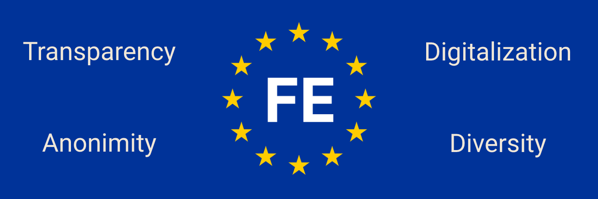

# ForumEcho

🙋‍♀️ We have developed a platform where EU-Citizens can post their own ideas for the European Union and Europe. 

## Technology
We are using the following technologies to power ForumEcho
- Angular (FrontEnd)
- NestJS (BackEnd)
- MongoDB Atlas (Database)

## Donations
If you want to help us to finance our servers and domains, you can sponsor us on these sites:

## Team
- [Arthur Van Loo](https://github.com/avanloo01) (Founder & FrontEnd Developer)
- [Johannes Höllwerth](https://github.com/Baumistlustig) (Co-Foudner & FullStack Devloper)

## Features

- Homepage
    - all posts
    - Sorter
- Login
- Register
- New Post
- Edit Post
- AboutPage
- Forgot-Password
- User-Settings
